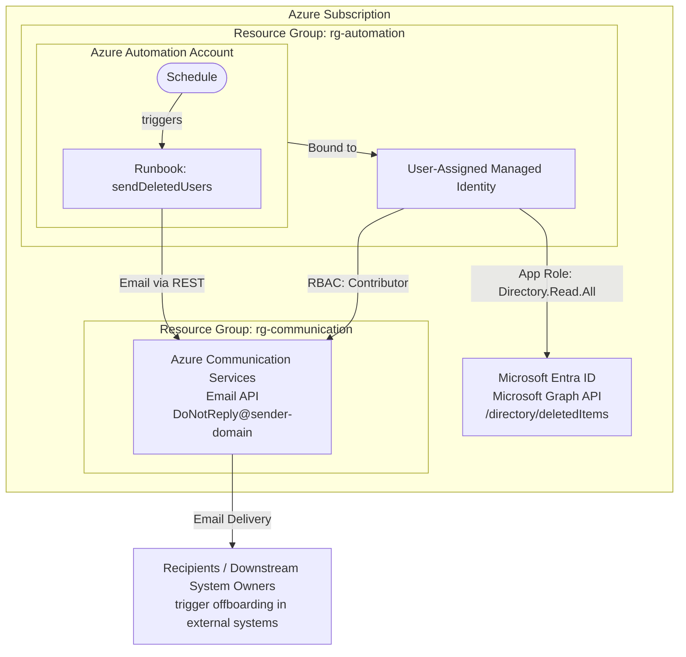
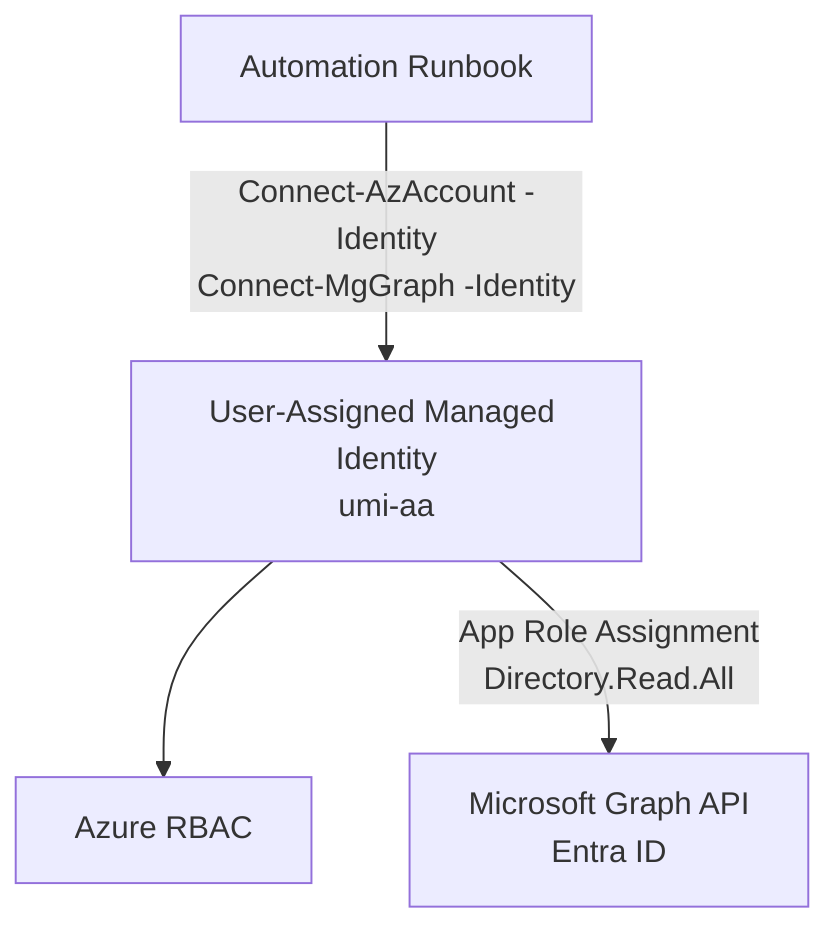
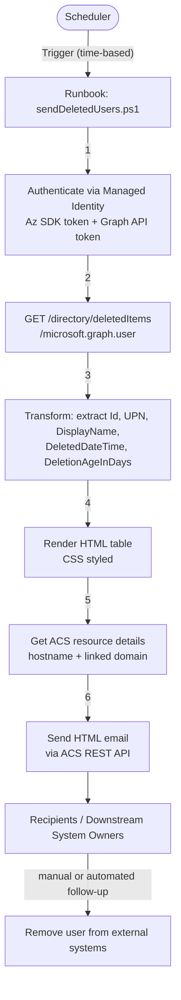
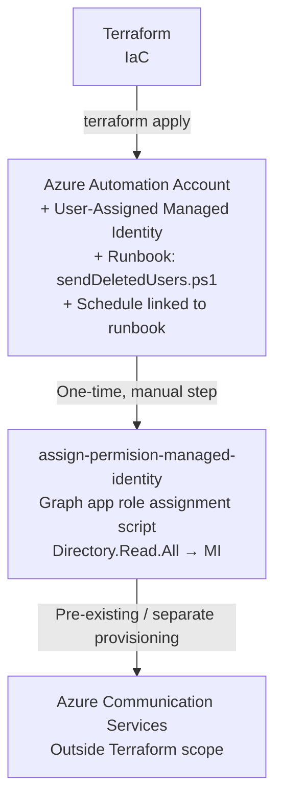

# High Level Design — Deleted Users Automation Report

## 1. Purpose

This document describes the high-level architecture of the **Deleted Users Automation Report** solution. It is intended for solution architects, cloud engineers, and security reviewers who need to understand the overall design without deep-diving into code-level implementation details.

---

## 2. Architecture Overview

The solution is fully serverless and hosted in Microsoft Azure. It uses Azure Automation as the compute layer, Microsoft Entra ID (via Graph API) as the data source, and Azure Communication Services as the email delivery mechanism. All authentication is handled through a User-Assigned Managed Identity — no passwords or secrets are used.

The primary purpose of this solution is to **notify administrators and service owners about users deleted from Entra ID so that those accounts can be removed from downstream systems** (SaaS platforms, on-premises directories, ITSM tools, etc.) that do not automatically process Entra ID lifecycle events.



---

## 3. Component Descriptions

### 3.1 Azure Automation Account (`<automation-account-name>`)

The central orchestration component. It hosts:

- **Runbooks** — PowerShell-based scripts executed on demand or on schedule.
- **Schedules** — Recurring time-based triggers (e.g., daily at 08:00 UTC).
- **Modules** — Pre-installed PowerShell modules (Az, Microsoft.Graph, Az.Communication, etc.).

The account is configured with a **User-Assigned Managed Identity** as its primary identity.

### 3.2 User-Assigned Managed Identity (`<managed-identity-name>`)

An Azure-native identity (no password, no secret rotation needed) that represents the Automation Account in all API calls. It carries two sets of permissions:

| Target                                | Permission                          | Assignment Type     |
| ------------------------------------- | ----------------------------------- | ------------------- |
| Microsoft Graph API                   | `Directory.Read.All`                | App Role Assignment |
| Azure Communication Services resource | `Contributor` (or scoped ACS roles) | Azure RBAC          |

### 3.3 Runbook — `sendDeletedUsers.ps1`

The primary execution unit. Responsibilities:

1. Authenticate to Azure (Az SDK) and Microsoft Graph.
2. Call Graph API to retrieve soft-deleted users from the Entra ID recycle bin.
3. Transform the raw API response into a structured list.
4. Render an HTML email body with a styled table.
5. Discover the ACS endpoint and sender address dynamically.
6. Deliver the email via ACS.

### 3.4 Azure Communication Services (`<acs-resource-name>`)

Provides the email sending capability. Key attributes:

- **Endpoint:** `https://<acs-resource-name>.<region>.communication.azure.com/`
- **Sender domain:** `AzureManagedDomain` (Microsoft-managed) or a custom verified domain.
- **Sender address:** `DoNotReply@<sender-domain>`

### 3.5 Microsoft Graph API

The data source. The solution calls the v1.0 endpoint:

```
GET https://graph.microsoft.com/v1.0/directory/deletedItems/microsoft.graph.user
```

Returns all soft-deleted user objects still within the 30-day retention window.

---

## 4. Security Architecture

### 4.1 Identity and Authentication



- **No credentials are stored** in the Automation Account, Key Vault, or code.
- The Managed Identity token is obtained at runtime from the Azure Instance Metadata Service.
- Both Az module authentication and Graph API authentication use the same underlying identity.

### 4.2 Principle of Least Privilege

| Access                            | Scope             | Justification                                         |
| --------------------------------- | ----------------- | ----------------------------------------------------- |
| `Directory.Read.All` (Graph)      | Tenant-wide       | Required to read deleted objects across the directory |
| `Contributor` or scoped ACS roles | ACS resource only | Required to retrieve ACS hostname and send emails     |

> **Note:** `Contributor` on the ACS resource is acceptable for a POC. For production, use the three scoped ACS RBAC roles (`CommunicationServiceEmail.Send`, `CommunicationServiceEmail.Domains.Read`, `CommunicationService Reader`) instead.

---

## 5. Data Flow Diagram



---

## 6. Infrastructure as Code

The infrastructure is managed with **Terraform**. The three required resources are provisioned as code; everything else is configured via the Azure Portal or the one-time permission setup script.

| Terraform Resource Type                                           | Purpose                                          |
| ----------------------------------------------------------------- | ------------------------------------------------ |
| `azurerm_automation_account`                                      | Automation Account with User-Assigned MI binding |
| `azurerm_user_assigned_identity`                                  | Managed Identity used by the runbook             |
| `azurerm_automation_runbook`                                      | Uploads `sendDeletedUsers.ps1`                   |
| `azurerm_automation_schedule` + `azurerm_automation_job_schedule` | Recurring trigger linked to the runbook          |

> The Azure Communication Services resource (ACS) is **not managed by Terraform** in this project — it is assumed to be pre-existing or provisioned separately. The runbook discovers the ACS endpoint dynamically at runtime.

---

## 7. Deployment Overview



---

## 8. Related Documents

- [Project Overview](OVERVIEW.md)
- [Low Level Design](LOW-LEVEL-DESIGN.md)
